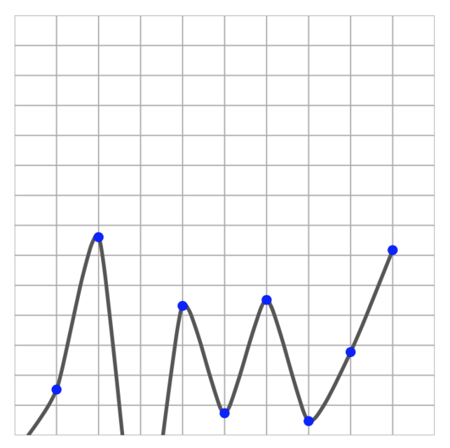

# SwiftGraphKit

[](https://travis-ci.org/cbessonnet75@gmail.com/SwiftGraphKit)
[](https://cocoapods.org/pods/SwiftGraphKit)
[](https://cocoapods.org/pods/SwiftGraphKit)
[](https://cocoapods.org/pods/SwiftGraphKit)

## Example

To run the example project, clone the repo, and run `pod install` from the Example directory first.

## Installation

SwiftGraphKit is available through [CocoaPods](https://cocoapods.org). To install
it, simply add the following line to your Podfile:

```ruby
pod 'SwiftGraphKit'
```

## Usage

### GraphView

A GraphView is a classic UIView, you can use it on your app like other UIView.
Drawing will be depends of configuration, you can add graphs, grid, axis, ...

```swift
// Sample with autolayout
let graphView = GraphView()
graphView.translatesAutoresizingMaskIntoConstraints = false

view.addSubview(graphView)

NSLayoutConstraint.activate([
    graphView.centerXAnchor.constraint(equalTo: view.centerXAnchor),
    graphView.centerYAnchor.constraint(equalTo: view.centerYAnchor),
    graphView.widthAnchor.constraint(equalTo: view.widthAnchor, multiplier: 0.9),
    graphView.heightAnchor.constraint(equalTo: graphView.widthAnchor)
])
```

### Graphs

Now, you will see how add a Graph to GraphView. Graph is a collection of GraphPoint.
Graph draw a curve and point. On this framework, graph draw only points.
To draw a curve you can using a child of Graph like BezierGraph or BreakLineGraph.

```swift
let graph = BezierGraph()
graph.color     = .darkGray
graph.thickness = 3.0

graphView.add(graph: graph)
```
It's the same logic on GraphPoint, you can use a child of this class to have a different redering.

```swift
var points = [GraphPoint]()

for x in minX..<maxX {
    let y = Float.random(in: 45..<120)
    let roundedPoint = RoundedPoint(x: CGFloat(x), y: CGFloat(y))
    points.append(roundedPoint)
}

graph.addData(data: points)
```

### Result



## DataFrame

### Concept

DataFrame is a core concept of framework. You will not use frame, or pixel to draw, but a custom unit on x and y.

```swift
let minX: CGFloat = 0
let maxX: CGFloat = 6
let dataFrame = CGRect(x: minX, y: 30, width: maxX - minX, height: 220)
```
You can imagine x corresponding to a day of week (0 to 6).
And you can imagine your heart rate on y (30 to 220).

Framework will convert your unit to pixel. So you can resize your graphView, graph will be animated to fit with it's frame.

If you don't know your minY or maxY due to you use a dataSource on GraphView, you can activate autoresize.

### DataArea

As you can see on some sample, you can deplace on graph by scrolling and zooming. Limit on graph is base on dataArea.

## Advanced Usage

### How make an override of Graph

### How make an overide of GraphPoint

### How work dataSource ?

## How working the framework

All objects of framework is CALayer or a subclass of this class. You will find a CADisplayLink to synchonize rendering of each graphical components. Rendering is do with 60 fps.


## Author

Charles BESSONNET, you can write me to cbessonnet75@gmail.com.

## License

SwiftGraphKit is available under the MIT license. See the LICENSE file for more info.
